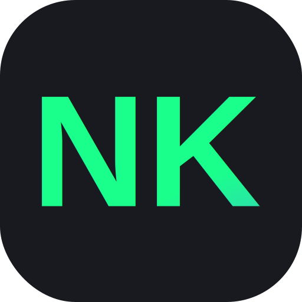

# 🚀 Nazif Keyan's Portfolio

<div align="center">
  
  
  [](https://nazif-keyan.vercel.app)
  [](https://reactjs.org/)
  [](https://vitejs.dev/)
</div>

## 🌟 Features

- 🤖 **AI Integration** - Interactive AI assistants for portfolio exploration
- 🎨 **Modern UI/UX** - Sleek design with particle animations and custom cursor
- 🔒 **Security-First Approach** - Implementing cybersecurity best practices
- 📱 **Responsive Design** - Seamless experience across all devices
- ⚡ **High Performance** - Built with Vite for optimal loading speeds
- 🌈 **Interactive Elements** - Dynamic components and smooth animations

## 🛠️ Tech Stack

- **Frontend Framework**: React with Vite
- **Styling**: Emotion (CSS-in-JS)
- **State Management**: React Hooks
- **AI Integration**: Advanced AI Models
- **Animations**: Framer Motion
- **Icons**: React Icons
- **Deployment**: Vercel
- **Version Control**: Git & GitHub

## 🚀 Quick Start

1. **Clone the repository**
   ```bash
   git clone https://github.com/Keyanog/port1.git
   cd portfolio-emotion
   ```

2. **Install dependencies**
   ```bash
   npm install
   ```

3. **Set up environment variables**
   ```bash
   cp .env.example .env
   # Add your environment variables
   ```

4. **Start development server**
   ```bash
   npm run dev
   ```

5. **Build for production**
   ```bash
   npm run build
   ```

## 🔐 Security Features

- ✅ Secure API key handling
- ✅ Environment variable protection
- ✅ Input validation and sanitization
- ✅ Modern security headers
- ✅ Protected routes and endpoints

## 🎯 Core Components

- **AI Chatbots**: Interactive assistants for portfolio exploration
- **Particle Background**: Dynamic visual elements
- **Custom Cursor**: Enhanced user interaction
- **Contact Form**: Secure communication channel
- **Project Showcase**: Interactive project display
- **Skill Visualization**: Dynamic skill representation

## 📦 Project Structure

```
portfolio-emotion/
├── public/
│   └── NK.svg
├── src/
│   ├── components/
│   │   ├── SecondChatbot.jsx
│   │   ├── CustomCursor.jsx
│   │   └── ...
│   ├── data/
│   │   └── personal_info.txt
│   └── App.jsx
├── .env.example
└── package.json
```

## 🌐 Live Demo

Visit the live portfolio: [nazif-keyan.vercel.app](https://nazif-keyan.vercel.app)

## 🤝 Connect With Me

- 📧 Email: nazif.keyan@gmail.com
- 💼 GitHub: [@Keyanog](https://github.com/Keyanog)
- 🔗 LinkedIn: [Nazif Keyan](#)

## 📄 License

This project is licensed under the MIT License - see the [LICENSE](LICENSE) file for details.

---

<div align="center">
  <sub>Built with 💚 by Nazif Keyan</sub>
</div>
